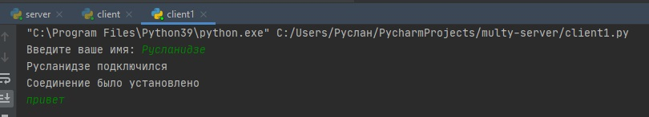
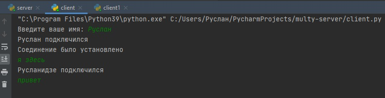
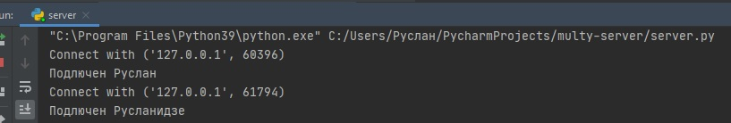

# multy-server
Нужно сделать многопоточный сервер,
реализовать простой чат сервер на базе сервера аутентификации. Сервер должен обеспечивать подключение многих пользователей одновременно, отслеживание имен пользователей, поддерживать историю сообщений и пересылку сообщений от каждого пользователя всем остальным.
Как выглядит подключение первого клиента: 
                                                                            
Такое же подлкючение для второго клиента:
                                                             
Как это все происходит на сервере:

